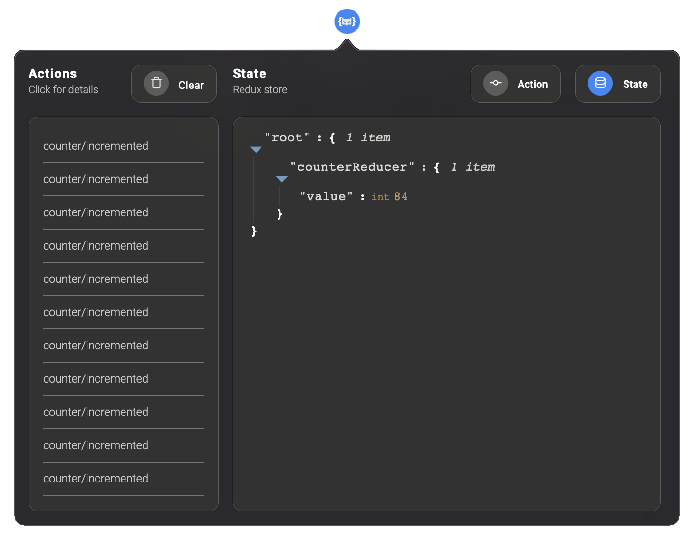

# Redux Monitor
A monitoring tool for debugging [Redux](https://github.com/reactjs/redux)-based application state changes.


## Installation
This application has two parts:
- The Safari extension, current repository, which you can find on the [App Store](https://apps.apple.com/us/app/redux-monitor/id1575132553). 
- The spy, which you can install as a yarn/npm dependency. 


### Browser extension
At the moment Redux monitor is only made for Safari. You can find it on the App Store. 


### Node module
The Safari extension works in conjunction with [spy](https://github.com/reyraa/redux-monitor-spy), a middleware that communicates all Redux actions and the application state with the Safari extension.

Import `redux-monitor-spy` and add it to your middleware array:

```

import spy from 'redux-monitor-spy'; // Import this module
import sampleReducer from './reducers';

const middleWares = [spy]; // Then add it to your middleware array.
const App = combineReducers({ sampleReducer });
const store = createStore(App, compose(applyMiddleware(...middleWares)));
export default store;

```

## Development
If you see a feature missing, please open an [issue](https://github.com/reyraa/redux-monitor/issues). I'll try to implement new features regularly.

If you're interested in fixing a bug, your contributions are more that welcome. Please open an [issue](https://github.com/reyraa/redux-monitor/issues), use the template to explain the bug. Then open an pull request to address said issue.

If you're interested in developing new features, please open an issue, wait for me and other community members to discuss and agree on the acceptance criteria, then start the development.


### Prerequisites
Since Redux Monitor is specifically developed for Safari, the following list is explained for Mac users.
 - Git
   - `brew install git`
 - NodeJS
   - `brew install node`
 - npm
   - npm is shipped with NodeJS. but to have a specific version installed see [here](https://stackoverflow.com/questions/9755841/how-can-i-change-the-version-of-npm-using-nvm).
 - Xcode
   - Find Xcode on the [App Store](https://apps.apple.com/de/app/xcode/id497799835?l=en&mt=12).


### Environment setup
```
git clone https://github.com/reyraa/redux-monitor.git
cd redux-monitor
npm install
```


## Contributors
See [contributors section](https://github.com/reyraa/redux-monitor/graphs/contributors).


## License
Redux Monitor is licensed under MIT. Feel free to use it for personal or business purpose.
